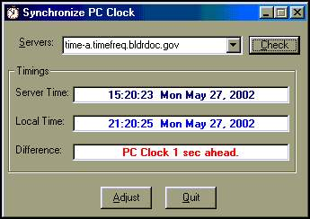



## SetTime

### Description

SetTime will synchronize your computer clock from a remote time server using Time Protocol. It uses the Ms Winsock.OCX control to get the job done. A Tutorial is also included which described the protocols etc. I will try to update it and make it more informative when ever i have free time :)
 
### More Info
 

             |
---                |---
**Submitted On**   |2002-06-01 20:18:16
**By**             |[Sami ur Rahman Qazi](https://github.com/Planet-Source-Code/PSCIndex/blob/master/ByAuthor/sami-ur-rahman-qazi.md)
**Level**          |Intermediate
**User Rating**    |4.8 (29 globes from 6 users)
**Compatibility**  |VB 5\.0, VB 6\.0
**Category**       |[Complete Applications](https://github.com/Planet-Source-Code/PSCIndex/blob/master/ByCategory/complete-applications__1-27.md)
**World**          |[Visual Basic](https://github.com/Planet-Source-Code/PSCIndex/blob/master/ByWorld/visual-basic.md)
**Archive File**   |[SetTime975266222002\.zip](https://github.com/Planet-Source-Code/sami-ur-rahman-qazi-settime__1-36140/archive/master.zip)

